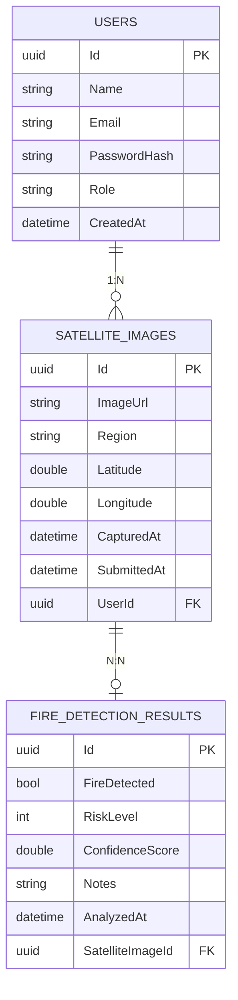
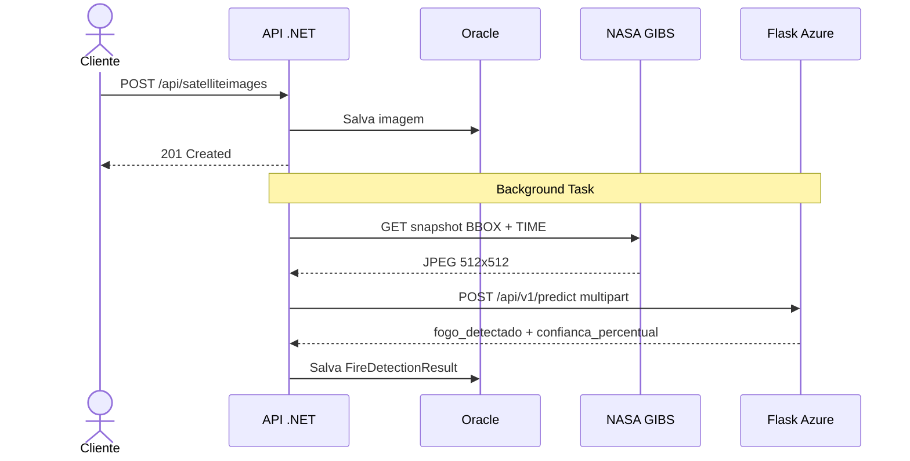
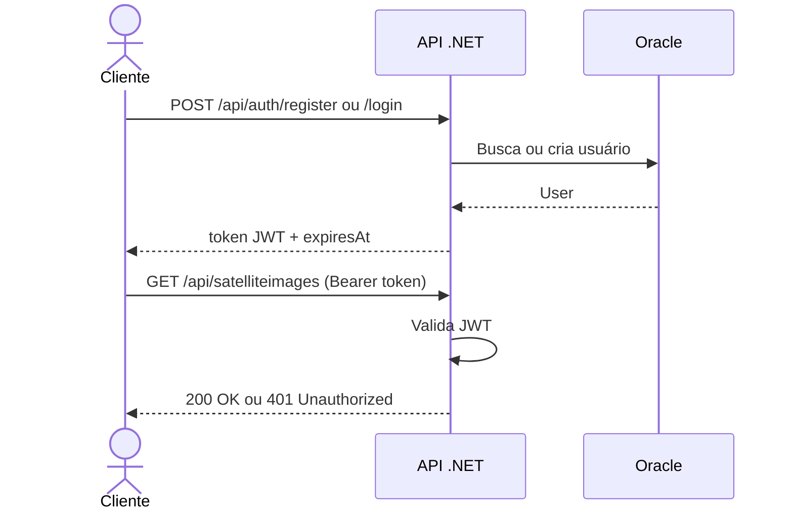
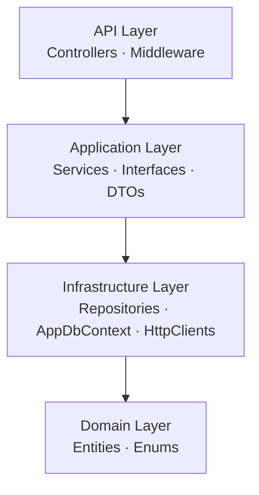

# EcoOrbit — Fire Detection API
Advanced Business Development with .NET — Global Solution 2026

FIAP — Análise e Desenvolvimento de Sistemas

## Integrantes
* João Victor Alves da Silva - RM 559726
* Vinicius Kenzo Tocuyosi - RM 559982
* Lucas Gomes - RM 559607

## Repositórios do Projeto
| Componente | Repositório |
| --- | --- |
| API .NET | https://github.com/JoaoVictor087/ecoorbit-dotnet |
| Modelo Deep Learning| https://github.com/JoaoVictor087/eco-orbit-deep-learning |

## Sobre o Projeto
O EcoOrbit é um sistema de detecção de incêndios via imagens de satélite. O usuário submete coordenadas geográficas e uma data; a API automaticamente:

1. Baixa a imagem de satélite real da NASA GIBS (MODIS Terra, 512×512px)
2. Envia a imagem para o modelo CNN hospedado no Azure (Flask)
3. Persiste o resultado da classificação no Oracle — fireDetected, riskLevel, confidenceScore

Tudo isso acontece de forma assíncrona em background — o endpoint responde imediatamente com 201 e o resultado de detecção fica disponível em segundos.

## Arquitetura de entidades


## Pipeline do projet



## Fluxo de autenticação



## Camada de arquitetura


## Tecnologias
| Tecnologia | Uso |
| --- | --- |
| ASP.NET Core 10 | Framework web |
| Entity Framework Core 8 | ORM |
| Oracle EF Core Provider | Oracle |
| Oracle XE 21c (Docker) | Banco de dados |
| JWT Bearer | Autenticação |
| Swashbuckle 6 | Swagger/OpenAPI |
| xUnit + Moq + FluentAssertions | Testes |
| NASA GIBS / Worldview | Imagens de satélite |
| Flask + TensorFlow (Azure) | Modelo CNN de detecção |

## Como Rodar

### Pré-requisitos
* .NET 10 SDK
* Docker
* EF Core Tools

## 1. Inicializar o Banco de Dados (Oracle XE)
Inicie o container do banco de dados e acompanhe os logs até que o banco esteja pronto para conexões:
```bash
docker compose up -d
docker logs -f fire_detection_db
# Aguarde a mensagem: "DATABASE IS READY TO USE!"
```

### 2. Executar as Migrações do EF Core
Com o banco de dados ativo, aplique as migrações para estruturar as tabelas necessárias:
```bash
cd src/ecoorbit-dotnet
dotnet ef database update
```

### 3. Iniciar a API
Execute a aplicação. Por padrão, as credenciais e conexões necessárias já vêm configuradas de forma segura para o ambiente de desenvolvimento local:
```bash
dotnet run
```
* **Swagger UI:** `http://localhost:5238/swagger`
* **Health Check:** `http://localhost:5238/health`

## Referência da API (Endpoints Principais)

Os exemplos de payloads abaixo descrevem como interagir com o sistema. Para autenticação, inclua o cabeçalho `Authorization: Bearer <seu_token>` nas rotas protegidas.

### 1. Registro de Novo Usuário
Cadastra um perfil no sistema para permitir o envio de análises.

* **Método:** `POST`
* **Rota:** `/api/auth/register`
* **Cabeçalhos:** `Content-Type: application/json`

#### Corpo da Requisição (Payload)
```json
{
  "name": "Joao Victor",
  "email": "joao@ecoorbit.com",
  "password": "senha123"
}
```

#### Resposta Esperada (200 OK)
```json
{
  "token": "eyJhbGciOiJIUzI1NiIsInR5cCI6IkpXVCJ9...",
  "name": "Joao Victor",
  "email": "joao@ecoorbit.com",
  "role": "Analyst",
  "expiresAt": "2026-06-08T10:00:00Z"
}
```

---

### 2. Submeter Coordenadas de Imagem de Satélite
Inicia a busca da imagem na NASA e agenda a análise de risco em background.

* **Método:** `POST`
* **Rota:** `/api/satelliteimages`
* **Cabeçalhos:** * `Content-Type: application/json`
    * `Authorization: Bearer <token>`

#### Corpo da Requisição (Payload)
```json
{
  "region": "Amazonia Legal - AM",
  "latitude": -3.5123,
  "longitude": -53.2412,
  "capturedAt": "2026-06-03T00:00:00Z"
}
```

#### Resposta Esperada (201 Created)
```json
{
  "id": "219f71d3-2db8-49cf-b904-6eccfe9edffc",
  "imageUrl": "[https://wvs.earthdata.nasa.gov/api/v1/snapshot](https://wvs.earthdata.nasa.gov/api/v1/snapshot)?...",
  "region": "Amazonia Legal - AM",
  "latitude": -3.5123,
  "longitude": -53.2412,
  "capturedAt": "2026-06-03T00:00:00Z",
  "submittedAt": "2026-06-08T02:38:46Z",
  "userId": "597d688e-d333-4aeb-92d4-523be9053e77",
  "userName": "Joao Victor",
  "hasDetectionResult": false
}
```

---

### 3. Consultar Resultado de Detecção de Incêndio
Consulta o resultado da análise gerada pelo modelo de Deep Learning.

* **Método:** `GET`
* **Rota:** `/api/firedetectionresults/image/{imageId}`
* **Cabeçalhos:** * `Authorization: Bearer <token>`

#### Resposta Esperada (200 OK)
```json
{
  "id": "f1a26b41-8e17-4f19-8cc3-b86233693fd4",
  "fireDetected": false,
  "riskLevel": 0,
  "riskLevelName": "None",
  "confidenceScore": 0.9586,
  "notes": "Analise automatica via eco-orbit Flask — 2026-06-08",
  "analyzedAt": "2026-06-08T02:38:48Z",
  "satelliteImageId": "219f71d3-2db8-49cf-b904-6eccfe9edffc",
  "region": "Amazonia Legal - AM"
}
```

---

### 4. Health Check do Sistema
Verifica a integridade e disponibilidade da API.

* **Método:** `GET`
* **Rota:** `/health`

#### Resposta Esperada (200 OK)
```
Healthy
```

## Testes Automatizados

Para executar os testes unitários do projeto, navegue até a pasta de testes e execute o comando correspondente:

```bash
cd tests/ecoorbit-dotnet.Tests
dotnet test --verbosity normal
```

### Detalhamento da Cobertura de Testes
| Classe do Serviço | Cenários Cobertos |
| :--- | :--- |
| `AuthServiceTests` | - Cadastro bem-sucedido com e-mail único<br>- Bloqueio de cadastro de e-mail duplicado<br>- Login bem-sucedido com credenciais corretas<br>- Falha de autenticação por senha incorreta |
| `SatelliteImageServiceTests` | - Busca de registro existente por Id<br>- Tratamento de erro para Id inexistente<br>- Cadastro de imagem associada a usuário ativo<br>- Bloqueio de cadastro para usuário inválido |
| `FireDetectionResultServiceTests` | - Criação de resultado inédito para imagem válida<br>- Bloqueio de duplicidade de resultado para uma mesma imagem<br>- Retorno vazio ou erro para busca de Id inexistente |

## Estrutura do Projeto
```
ecoorbit-dotnet/
├── docker-compose.yml
├── src/
│   └── ecoorbit-dotnet/
│       ├── Domain/
│       │   ├── Entities/          # User, SatelliteImage, FireDetectionResult
│       │   └── Enums/             # FireRiskLevel
│       ├── Application/
│       │   ├── DTOs/              # Modelos de entrada e saída (Requests/Responses)
│       │   ├── Interfaces/        # Contratos abstratos de serviços e repositórios
│       │   └── Services/          # Implementação das regras de negócio
│       ├── Infrastructure/
│       │   ├── Data/              # Contexto de dados (AppDbContext)
│       │   ├── Http/              # Clients de APIs externas (Flask Client)
│       │   ├── Migrations/        # Histórico de alterações do banco de dados (EF Core)
│       │   └── Repositories/      # Acesso direto ao banco de dados
│       └── Api/
│           ├── Controllers/       # Endpoints expostos (Auth, SatelliteImages, Results)
│           └── Middleware/        # Captura global de exceções
└── tests/
    └── ecoorbit-dotnet.Tests/
        └── Services/              # Testes unitários dos serviços de aplicação
```

## Classificação de Níveis de Risco
| Valor Armazenado | Nome do Nível | Critério Aplicado |
| :---: | :--- | :--- |
| 0 | None | Sem indícios de focos de incêndio detectados. |
| 1 | Low | Fogo detectado, porém com grau de confiança inferior a 50%. |
| 2 | Medium | Fogo detectado, com nível de confiança entre 50% e 70%. |
| 3 | High | Fogo detectado, com nível de confiança entre 70% e 85%. |
| 4 | Critical | Fogo detectado, com alto índice de confiança superior a 85%. |